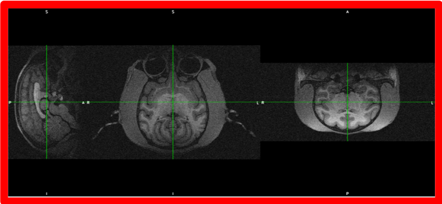
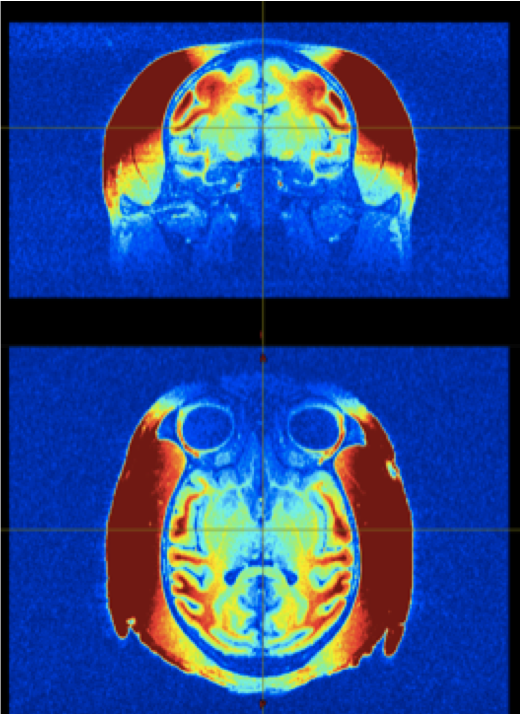
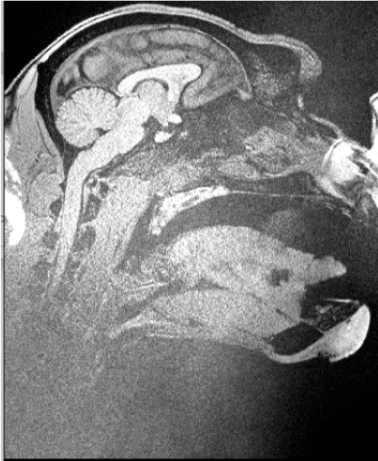

## Welcome to PRIME-RE
### The PRIMatE Research Exchange

The preprocessing and analysis of nonhuman primate (NHP) magnetic resonance imaging (MRI) data presents some unique challenges.
PRIME-RE aims to provide a description of the main difficulties and list the existing solutions associated with each of the processing steps commonly performed on NHP MRI data.
PRIME-RE is maintained and curated by members of the [PRIME-DE consortium](http://fcon_1000.projects.nitrc.org/indi/indiPRIME.html). 

#### How to contribute ?
Send new content by using [this template file](New_Resource_Template.md) to create a new issue [here](https://github.com/PRIME-RE/prime-re.github.io/issues)! You can also join our communication channel around the Primate Data Exchange on the Brainhack community on [PRIME-DE Mattermost](https://mattermost.brainhack.org/brainhack/channels/prime-de) or specifically for this Primate Resource Exchange via on [PRIME-RE Mattermost](https://mattermost.brainhack.org/brainhack/channels/prime-re) .

### [Atlases](#atlases)

### [Structural preprocessing](#structpreproc)
  
  - [What is it about?](#structdescription)
  - [Issues linked to NHP imaging](#structissues)
  - [Steps](#structsteps)
      - [Preparation of data (Cropping, deoblique…)](#structpreparation)
      - [Registration to template](#structregistration)
      - [Brain extraction / skull stripping](#structextraction)
      - [Segmentation (GM, WM, CSF? Subcortical?bone, non brain soft tissue? air?)](#structsegmentation)
      - [Surface generation](#structsurf)
      - [Morphometry measures (thickness, curvature etc)](#structmeasures)
      
  - [Pipelines Reviews](#structlinks)  
  - [Communication](structural_preprocessing/data_preparation.md#communication)
   

### [fMRI preprocessing](#funcpreproc)

# Atlases
Comming soon...

 
# Structural preprocessing
 
## What is it about?
Several steps to obtain a segmented brain with possibility to create surfaces

 
## Issues specific to NHP imaging
- non standard orientation: sphinx position, oblique orientation

- strong intensity bias due to a huge variety of coils used

- large FOV / non brain tissue

 
## Steps
 
### Preparation of data (Cropping, deoblique…)

- **What is is about?**

- **Solutions**

  
### Registration to template

 
### Brain extraction / skull stripping

 
### Segmentation (GM, WM, CSF? Subcortical?bone, non brain soft tissue? air?)

 
### Surface generation

 
### Morphometry measures (thickness, curvature etc)

 
## Pipelines Reviews
### Chris' notebook
(description should be here)
[Chris' notebook html](structural_preprocessing/surfaces_and_flatmaps_notebook/Surfaces_and_Flatmaps.html)  - [Download Chris' notebook](structural_preprocessing/surfaces_and_flatmaps_notebook/Surfaces_and_Flatmaps.ipynb)
### Macapype
Python package that provides pipelines for NHP anatomical preprocessing using Nipype.
[github repository](https://github.com/BastienCagna/macapype)

| Name | Short description | Links |
| --- | --- | --- |
| Surfaces and flatmaps | Jupyter notebook that ... | [view](structural_preprocessing/surfaces_and_flatmaps_notebook/Surfaces_and_Flatmaps.html) - [download](structural_preprocessing/surfaces_and_flatmaps_notebook/Surfaces_and_Flatmaps.ipynb) |
| Macapype | Python package for anatomical preprosessing using Nipype. | [github](https://github.com/BastienCagna/macapype) - [details](https://github.com/PRIME-RE/prime-re.github.io/issues/7) |

<a name="funcpreproc">
# Functional Preprocessing

