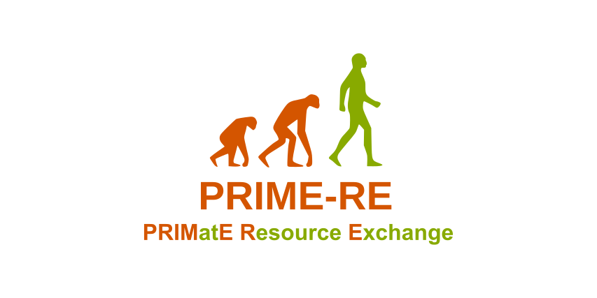

## Welcome to PRIME-RE
### The PRIMatE Research Exchange

The preprocessing and analysis of nonhuman primate (NHP) magnetic resonance imaging (MRI) data presents some unique challenges.
PRIME-RE aims to provide a description of the main difficulties and the existing solutions associated with each of the processing steps commonly performed on NHP MRI data.
PRIME-RE is maintained and curated by members of the [PRIME-DE consortium](http://fcon_1000.projects.nitrc.org/indi/indiPRIME.html). 

### [Structural preprocessing](#structpreproc)
  
  - [What is it about?](#description)
  - [Issues linked to NHP imaging](#issues)
  - [Steps](#steps)
      - [Preparation of data (Cropping, deoblique…)](#preparation)
      - [Registration to template](#registration)
      - [Brain extraction / skull stripping](#extraction)
      - [Segmentation (GM, WM, CSF? Subcortical?bone, non brain soft tissue? air?)](#segmentation)
      - [Surface generation](#surf)
      - [Morphometry measures (thickness, curvature etc)](#measures)
      
  - [Pipelines Reviews](pipelines/pipelines_reviews.md#links)  
    &rarr; Direct Access:
     - [Chris' notebook html](structural_preprocessing/surfaces_and_flatmaps_notebook/Surfaces_and_Flatmaps.html) - [Download Chris' notebook](structural_preprocessing/surfaces_and_flatmaps_notebook/Surfaces_and_Flatmaps.ipynb)
     - [macapype](https://github.com/BastienCagna/macapype)
  - [Communication](structural_preprocessing/data_preparation.md#communication)
   

### [fMRI preprocessing](functional_preprocessing/)

 
# Structural preprocessing
 
## What is it about?
Several steps to obtain a segmented brain with possibility to create surfaces

 
## Issues specific to NHP imaging
- non standard orientation: sphinx position, oblique orientation

- strong intensity bias due to a huge variety of coils used

- large FOV / non brain tissue

 
## Steps
 
### Preparation of data (Cropping, deoblique…)

- **What is is about?**

- **Solutions**
  
### Registration to template
 
### Brain extraction / skull stripping
 
### Segmentation (GM, WM, CSF? Subcortical?bone, non brain soft tissue? air?)
 
### Surface generation
 
### Morphometry measures (thickness, curvature etc)

 
## Links to pipelines

 
## Communication
Link to the communication channel for your project. You can, for example, create a [Mattermost channel](https://mattermost.brainhack.org/brainhack/channels/prime-de) for your project inside the Brainhack community, and include a Mattermost badge   to invite people to Brainhack Mattermost, where they can then find and join your channel.  
Or create a community on [gitter](https://gitter.im/) and link to the chat by including a Gitter badge linking to your community 

