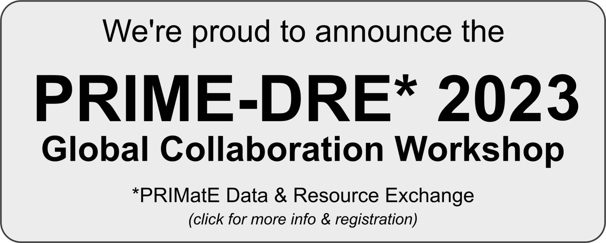

     
         
     
**IMPORTANT SURVEY** - *The [Society for Neuroscience](https://www.sfn.org/) is engaged in an effort to change the current institutional culture to be more supportive/protective of researchers working with animal models, particularly NHPs. NIH needs specific information and documentation of harassment to justify a need for change. SfN has created a survey to collect information from researchers regarding their experiences and the effects it has had on their professional and personal lives. [This anonymous survey](https://www.surveymonkey.com/r/DBV7F8Q) takes only 5-8 minutes to complete.*

# PRIME-RE
Welcome to the PRIMatE Resource Exchange (PRIME-RE), a community-driven resource exchange platform for non-human primate neuroimaging. Read more about this initiative in the [accompanying *NeuroImage* publication](https://doi.org/10.1016/j.neuroimage.2020.117519) and please consider citing the paper if this resource has been useful.

The preprocessing and analysis of nonhuman primate (NHP) magnetic resonance imaging (MRI) data presents some unique challenges. Over the years, many laboratories and researchers have created their own custom solutions to many of these problems. PRIME-RE provides an overview of the main difficulties and curates a collection of solutions for specific processing steps that currently exist within the NHP-MRI community. This is a community effort, initiated by members of the [PRIME-DE consortium](http://fcon_1000.projects.nitrc.org/indi/indiPRIME.html){:target="_blank"}. We strongly encourage you to [contribute](contribute.md) your workflows and pipelines.     

### Open science
Our goal is to accelerate reproducible discovery, minimise redundant efforts and maximise efficiency by allowing the community to curate relevant resources, disseminate and encourage open science, and strengthen communication in the research community. We aim at making NHP resources open and [FAIR](https://doi.org/10.1038/sdata.2016.18), and support the adoption of the [Brain Imaging Data Structure (BIDS)](https://doi.org/10.1038/sdata.2016.44){:target="_blank"} and [code development best practices](https://doi.org/10.1038/nn.4550){:target="_blank"}, such as version control, testing, and continuous integration.

### How to contribute ?
Send new content by using [this issue template](https://github.com/PRIME-RE/prime-re.github.io/issues/new?assignees=&labels=new-resource&template=new-resource.md&title=%3CResource+Name%3E). You can also join our communication channel on the Brainhack Community via [PRIME-RE Mattermost-channel](https://mattermost.brainhack.org/brainhack/channels/compmri_resourcehub){:target="_blank"}. If you want to discuss the Primate Data Exchange in general, join on [PRIME-DE Mattermost-channel](https://mattermost.brainhack.org/brainhack/channels/prime-de){:target="_blank"}. Suggest a new feature or pitch an idea for the PRIME-RE platform [here](https://github.com/PRIME-RE/prime-re.github.io/issues/new?assignees=&labels=Idea&template=new-ideas.md&title=%5BIdea%5D), ask a general question or start a discussion [here](https://github.com/PRIME-RE/prime-re.github.io/issues/new?assignees=&labels=QuestionOrDiscussion&template=question-and-discussion.md&title=%5BQuestionOrDiscussion%5D), or check the open Issues and Discussions [here](https://github.com/PRIME-RE/prime-re.github.io/issues).  

### Wiki
A [wiki](https://github.com/PRIME-RE/prime-re.github.io/wiki/){:target="_blank"} have been set up to share knowledge about NHP MRI acquisition and image processing. Anyone can share knowledge and experience (problems with solutions, fixes, tricks...) after requesting access.

### Resources
The PRIME-RE collection of resources is organized in several categories. If you feel like something is missing or erroneously categorized, don't hesitate to contact us. We make a disctinction between 'Pipelines' (custom written analysis solutions) and 'Software packages' (complete software solutions, many of which may appear in the pipelines)   

- [Templates & atlases](templates_and_atlases.md)
- Pipelines
    - [General analysis](pipelines_general.md)       
    - [Structural analysis](pipelines_structural.md)
    - [Functional analysis](pipelines_fmri.md)
    - [Diffusion analysis](pipelines_diffusion.md)  
    - [Cross-species analysis](pipelines_cross-species.md)   
- [Data sharing](data_sharing.md)
- [Software packages](software_packages.md)
- [Hardware & protocols](hardware.md)

### Contact & Collaborate     
This website is intended to be a meeting place for the NHP neuroimaging community. You can find some of the latest tools, methods, and data repositories here, but we hope you will also find international colleagues here, discover mutual interests and start new collaborations. Get in contact with people through the following communication channels:    

- You can contact the people behind PRIME-RE by writing a [GitHub Issue](https://github.com/PRIME-RE/prime-re.github.io/issues/new?assignees=&labels=Contact&template=contact.md&title=[Contact]:&nbsp;%3Ctopic%3E).    
- You can start a discussion about PRIME-RE or one of the tools on the [Discussions site](https://github.com/PRIME-RE/prime-re.github.io/discussions){:target="_blank"}.    
- You can contact developers of a shared resource through the contact links that are listed with the resources.    
- To ask a question or discuss an issue with NHP-MRI researchers, you can open send a message to the [NHP-MRI mailing list](https://groups.google.com/forum/#!forum/nhp-mri){:target="_blank"}.    
- To ask a question or discuss an issue with the broader neuroscience community, we suggest using [neurostars.org](https://neurostars.org/){:target="_blank"}. Tag your new thread with **prime-re** and/or the name of the resource you are asking about for optimal visibility.
- Other community-driven initiatives can be found on the [Community page.](community.md)
