{
 "cells": [
  {
   "cell_type": "markdown",
   "metadata": {},
   "source": [
    "# **Create Single Monkey Surfaces**  "
   ]
  },
  {
   "cell_type": "markdown",
   "metadata": {},
   "source": [
    "This notebook will guide you through the procedure to create single monkey surface representations in four steps (some are optional):  \n",
    "\n",
    "1. **(OPTIONAL)** Average multiple T1 scans from the same animal. (takes seconds)\n",
    "2. Segment the (averaged) T1 of an individual animal using the NMT template as a prior. (takes many hours)\n",
    "3. Create surfaces and flatmaps using Freesurfer. (takes up to to several hours depending on segmentation quality at the start)\n",
    "4. **(OPTIONAL)** Create additional surfaces with Connectome Workbench. (takes minutes)"
   ]
  },
  {
   "cell_type": "markdown",
   "metadata": {},
   "source": [
    "## Initiate \n",
    "Setting a few environment variables here so we can actually run code from this notebook"
   ]
  },
  {
   "cell_type": "code",
   "execution_count": null,
   "metadata": {},
   "outputs": [],
   "source": [
    "SUBJ=Eddy  # Name of the animal you are going to process\n",
    "NMT_path=/NHP_MRI/Template/NMT # path to the template folder\n",
    "startpath=pwd # current directory"
   ]
  },
  {
   "cell_type": "markdown",
   "metadata": {},
   "source": [
    "----\n",
    "----\n",
    "## **Step 1 (OPTIONAL): Average multiple T1 scans**\n",
    "\n",
    "----\n",
    "----\n",
    "\n",
    "### Requirements:\n",
    "- Freesurfer installation (https://surfer.nmr.mgh.harvard.edu/)\n",
    "- NIH Macaque Template (https://github.com/jms290/NMT)\n",
    "- One or more high resolution anatomical scans\n",
    "\n",
    "- The `average_multiple_t1.sh ` script  \n",
    "  \n",
    "### Procedure\n",
    "- Create a folder for your subject in the NIH Macaque Template folder as \n",
    "\n",
    "`<>/NHP_MRI/Template/NMT/single_subject_scans/<SUBJECT>`  \n",
    "\n",
    "- Inside this folder, create a subfolder with all individual T1 scan for this subject, e.g. \n",
    "\n",
    "`<>/NHP_MRI/Template/NMT/single_subject_scans/<SUBJECT>/<T1_FLD>/*.nii.gz`  \n",
    "\n",
    "- Copy the script `average_multiple_t1.sh` to the `<SUBJECT>` folder as well.  \n",
    "\n",
    "- Run this script with the name of the `<T1_FLD>` as input:  \n",
    "\n",
    "`$ ./average_multiple_t1.sh <T1_FLD>`  \n",
    "\n",
    "\n",
    "- The script will:  \n",
    "\n",
    "    - Correct for having the monkey in the sphinx position  \n",
    "    - Resample each T1 to 0.5 mm isotropic voxels  \n",
    "    - Reorient the colume for correct display in FSL (e.g., with FSLEyes)  \n",
    "    - Normalize the contrast gradient  \n",
    "    - Average the multiple T1's together using motion correction to account for small differences  \n",
    "  \n",
    "  \n",
    "- When the script is done, there should be a `<SUBJECT>.nii.gz` file in the root `<SUBJECT>` folder."
   ]
  },
  {
   "cell_type": "code",
   "execution_count": null,
   "metadata": {},
   "outputs": [],
   "source": [
    "# Get path and make folders\n",
    "NMT_ss_path=${NMT_path}/single_subject_scans/${SUBJ}\n",
    "mkdir -p ${NMT_ss_path}\n",
    "mkdir -p ${NMT_path}/single_subject_scans/${SUBJ}/T1s\n",
    "echo Copy the T1 files to ${NMT_path}/single_subject_scans/${SUBJ}/T1s"
   ]
  },
  {
   "cell_type": "code",
   "execution_count": null,
   "metadata": {},
   "outputs": [],
   "source": [
    "# Copy averaging script\n",
    "cp ${NMT_path}/single_subject_scans/average_multiple_t1.sh \\\n",
    "    ${NMT_path}/single_subject_scans/${SUBJ}/\n",
    "cd ${NMT_path}/single_subject_scans/${SUBJ}/\n",
    "# Run script\n",
    "./average_multiple_t1.sh T1s"
   ]
  },
  {
   "cell_type": "markdown",
   "metadata": {},
   "source": [
    "----\n",
    "----\n",
    "## **Step 2: Segment the single subject anatomy using the NMT template as a prior**\n",
    "\n",
    "----\n",
    "----\n",
    "\n",
    "### Requirements\n",
    "  - NIH Macaque Template (https://github.com/jms290/NMT)  \n",
    "  - ANTS (http://stnava.github.io/ANTs/)\n",
    "  - AFNI (https://afni.nimh.nih.gov/)\n",
    " \n",
    "### Procedure\n",
    "This will segment and process the single-subject anatomical and warp the D99 atlas (https://afni.nimh.nih.gov/Macaque) to your individual anatomy.  \n",
    "\n",
    "- Navigate to `<>/NHP_MRI/Template/NMT/single_subject_scans` in your terminal\n",
    "  \n",
    "- There should be a folder `<SUBJECT>` containing a T1 named `<SUBJECT>.nii.gz` (Step 1 produces this)\n",
    "  \n",
    "- Run the `align_and_process_singlesubject.sh` script with input `<SUBJECT>`:\n",
    "      \n",
    "- The following 2 steps can be executed together by running: `$ ./create_ss_atlas.sh <SUBJECT>`  \n",
    "\n",
    "    - Extracting single ROI masks from the warped atlas: `./extract_ROI.sh <SUBJECT>`  \n",
    "\n",
    "    - Creating a label-file that makes the warped atlas usable in FSLEyes: `./create_xml.sh <SUBJECT>`\n"
   ]
  },
  {
   "cell_type": "code",
   "execution_count": null,
   "metadata": {},
   "outputs": [],
   "source": [
    "# Go to the single subject folder in NMT\n",
    "cd ${NMT_path}/single_subject_scans\n",
    "# Run script to align and segment. This will take a long time (~8-10 hours)\n",
    "./align_and_process_singlesubject.sh ${SUBJ}"
   ]
  },
  {
   "cell_type": "markdown",
   "metadata": {},
   "source": [
    "You may already want to perform some manual adjustments here (e.g., white matter tends to be overestimated in the occipital lobe). There are many ways to do this but one easy way is with `ITK-SNAP` (http://www.itksnap.org/pmwiki/pmwiki.php). Whenever you decide to make adjustments, dot it on a copy of the original results and leave the original results intact.  \n",
    "\n",
    "In `ITK-SNAP` you can open the brain volume as the `Main Image` and load the segmentation volume as segmentation.\n",
    "\n",
    "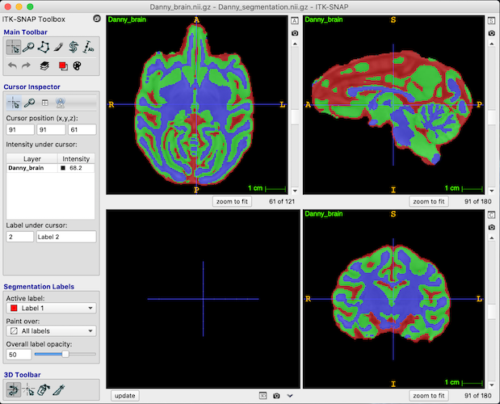\n",
    "\n",
    "Voxels in the segmentation are labeled red (value 1) for CSF, green (value 2) for grey matter, and blue (value 3) for white matter. You can use the paintbrush tool to change labels and save the adjusted segmentation file.\n",
    "\n",
    "To generate separate CSF/GM/WM masks you can run\n",
    "```\n",
    "fslmaths <SUBJECT>_segmentation.nii.gz -thr 0.9 -uthr 1.1 -bin <SUBJECT>_CSF.nii.gz\n",
    "fslmaths <SUBJECT>_segmentation.nii.gz -thr 1.9 -uthr 2.1 -bin <SUBJECT>_GM.nii.gz\n",
    "fslmaths <SUBJECT>_segmentation.nii.gz -thr 2.9 -uthr 3.1 -bin <SUBJECT>_WM.nii.gz\n",
    "fslmaths <SUBJECT>_segmentation.nii.gz -thr 0.5 -uthr 3.1 -bin <SUBJECT>_brainmask.nii.gz\n",
    "```\n",
    "\n",
    "In addtion you can create atlas files so you use the warped D99 atlas for this individual in `FSLEyes` "
   ]
  },
  {
   "cell_type": "code",
   "execution_count": null,
   "metadata": {},
   "outputs": [],
   "source": [
    "# Create usability files for the warped D99 atlas in individual space\n",
    "./create_ss_atlas ${SUBJ}"
   ]
  },
  {
   "cell_type": "markdown",
   "metadata": {},
   "source": [
    "----\n",
    "----\n",
    "## **Step 3: Create surfaces and flatmaps using Freesurfer**\n",
    "\n",
    "----\n",
    "----"
   ]
  },
  {
   "cell_type": "markdown",
   "metadata": {},
   "source": [
    "### Requirements  \n",
    "- Freesurfer installation (https://surfer.nmr.mgh.harvard.edu/)\n",
    "- Segmented individual subject T1\n",
    "\n",
    "### Procedure\n",
    "#### Create folders & copy files"
   ]
  },
  {
   "cell_type": "code",
   "execution_count": null,
   "metadata": {},
   "outputs": [],
   "source": [
    "# Path to the single_subjects folder in NMT where this subject's segmentation is located\n",
    "#NMT_src=${NMT_path}/single_subject_scans/${SUBJ}/NMT_${SUBJ}_process \n",
    "# adjust this path if you have manually adjusted and saved to a different folder, e.g.\n",
    "NMT_src=${NMT_path}/single_subject_scans/${SUBJ}/NMT_${SUBJ}_process/manual_adjust # for Danny & Eddy\n",
    "\n",
    "# create a folder for the freesurfer surfaces we will eventually end up with\n",
    "fsSurf=${NMT_path}/single_subject_scans/${SUBJ}/fsSurf\n",
    "mkdir -p ${fsSurf}\n",
    "\n",
    "# make subfolders for structure\n",
    "fsSurf_src=${fsSurf}/src\n",
    "fsSurf_mgz=${fsSurf}/mgz\n",
    "fsSurf_temp=${fsSurf}/temp\n",
    "mkdir -p ${fsSurf_src}\n",
    "mkdir -p ${fsSurf_mgz}\n",
    "mkdir -p ${fsSurf_temp}\n",
    "\n",
    "# initialize an array to be able to loop over hemispheres\n",
    "HEMI=(lh rh) "
   ]
  },
  {
   "cell_type": "code",
   "execution_count": null,
   "metadata": {},
   "outputs": [],
   "source": [
    "# copy the source files from the NMT segmentation to the freesurfer folders you just created\n",
    "cp ${NMT_src}/${SUBJ}_N4.nii.gz ${fsSurf_src}/T1.nii.gz\n",
    "cp ${NMT_src}/${SUBJ}_brain.nii.gz ${fsSurf_src}/brain.nii.gz\n",
    "cp ${NMT_src}/${SUBJ}_brain.nii.gz ${fsSurf_src}/brainmask.nii.gz # freesurfer brainmask aren't actually masks\n",
    "cp ${NMT_src}/${SUBJ}_WM.nii.gz ${fsSurf_src}/wm.nii.gz\n",
    "\n",
    "# copy source files again but keep these in original state \n",
    "# (for others the header will be changed to 'fake' 1 mm voxels, which is necessary for freesurfer)\n",
    "mkdir -p ${fsSurf_src}/org\n",
    "cp ${fsSurf_src}/*.nii.gz ${fsSurf_src}/org/"
   ]
  },
  {
   "cell_type": "markdown",
   "metadata": {},
   "source": [
    "#### Change headers to mimic 1mm isotropic voxels & make mgz files"
   ]
  },
  {
   "cell_type": "code",
   "execution_count": null,
   "metadata": {},
   "outputs": [],
   "source": [
    "# change headers\n",
    "3drefit -xdel 1.0 -ydel 1.0 -zdel 1.0 -keepcen ${fsSurf_src}/T1.nii.gz &\n",
    "3drefit -xdel 1.0 -ydel 1.0 -zdel 1.0 -keepcen ${fsSurf_src}/brain.nii.gz &\n",
    "3drefit -xdel 1.0 -ydel 1.0 -zdel 1.0 -keepcen ${fsSurf_src}/brainmask.nii.gz &\n",
    "3drefit -xdel 1.0 -ydel 1.0 -zdel 1.0 -keepcen ${fsSurf_src}/wm.nii.gz &\n",
    "# convert to mgz files for freesurfer\n",
    "mri_convert -c ${fsSurf_src}/T1.nii.gz ${fsSurf_mgz}/T1.mgz &\n",
    "mri_convert -c ${fsSurf_src}/brain.nii.gz ${fsSurf_mgz}/brain.mgz &\n",
    "mri_convert -c ${fsSurf_src}/brain.nii.gz ${fsSurf_mgz}/brainmask.mgz &\n",
    "mri_convert -c ${fsSurf_src}/brainmask.nii.gz ${fsSurf_mgz}/brainmask_binary.mgz &\n",
    "mri_convert -c ${fsSurf_src}/wm.nii.gz ${fsSurf_mgz}/wm.mgz &\n",
    "# create brain.finalsurfs.mgz\n",
    "mri_mask -T 5 ${fsSurf_mgz}/brain.mgz ${fsSurf_mgz}/brainmask.mgz ${fsSurf_mgz}/brain.finalsurfs.mgz &"
   ]
  },
  {
   "cell_type": "markdown",
   "metadata": {},
   "source": [
    "#### Get corpus callosum and pons voxel coordinates\n",
    "These will later define the cutting planes for the surface generation so make sure that 1) the corpus callosum is in the middle, and 2) the pons coordinates are low enough to not cut through cortex. \n",
    "\n",
    "Corpus callosum:  \n",
    "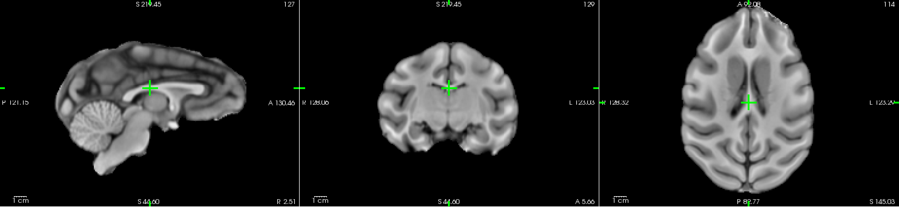\n",
    "\n",
    "Pons: \n",
    "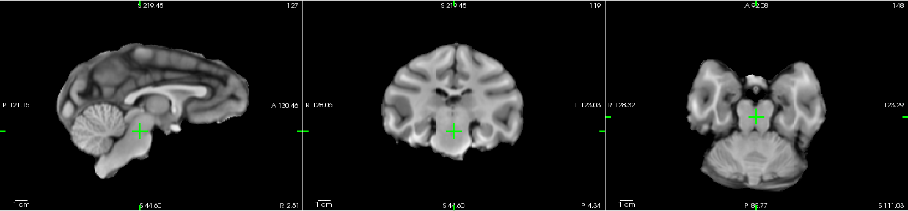"
   ]
  },
  {
   "cell_type": "code",
   "execution_count": null,
   "metadata": {},
   "outputs": [],
   "source": [
    "# Inspect volume to get voxel coordinates\n",
    "freeview -v ${fsSurf_mgz}/brain.mgz &"
   ]
  },
  {
   "cell_type": "code",
   "execution_count": null,
   "metadata": {},
   "outputs": [],
   "source": [
    "#DANNY\n",
    "#CC=(127 114 129) # corpus callosum\n",
    "#PONS=(124 148 119) # pons\n",
    "\n",
    "#EDDY\n",
    "CC=(131 113 122) # corpus callosum\n",
    "PONS=(131 149 117) # pons"
   ]
  },
  {
   "cell_type": "markdown",
   "metadata": {},
   "source": [
    "#### Fill the white matter volume & copy for backup before fixing"
   ]
  },
  {
   "cell_type": "code",
   "execution_count": null,
   "metadata": {},
   "outputs": [],
   "source": [
    "# Fill WM\n",
    "mri_fill -CV ${CC[0]} ${CC[1]} ${CC[2]} \\\n",
    "    -PV ${PONS[0]} ${PONS[1]} ${PONS[2]} \\\n",
    "    ${fsSurf_mgz}/wm.mgz ${fsSurf_mgz}/filled.mgz\n",
    "# copy the original white matter before applying fixes    \n",
    "cp ${fsSurf_mgz}/wm.mgz ${fsSurf_mgz}/wm_nofix.mgz"
   ]
  },
  {
   "cell_type": "markdown",
   "metadata": {},
   "source": [
    "#### Tesselate volumes & fix topology (First run)"
   ]
  },
  {
   "cell_type": "code",
   "execution_count": null,
   "metadata": {},
   "outputs": [],
   "source": [
    "# Tesselate\n",
    "# left hemisphere\n",
    "mri_pretess ${fsSurf_mgz}/filled.mgz 255 ${fsSurf_mgz}/brain.mgz ${fsSurf_mgz}/wm_filled-pretess255.mgz\n",
    "mri_tessellate ${fsSurf_mgz}/wm_filled-pretess255.mgz 255 ${fsSurf_temp}/lh.orig.nofix\n",
    "# right hemisphere\n",
    "mri_pretess ${fsSurf_mgz}/filled.mgz 127 ${fsSurf_mgz}/brain.mgz ${fsSurf_mgz}/wm_filled-pretess127.mgz\n",
    "mri_tessellate ${fsSurf_mgz}/wm_filled-pretess127.mgz 127 ${fsSurf_temp}/rh.orig.nofix\n",
    "\n",
    "# for both hemispheres\n",
    "for xh in ${HEMI[@]}; do\n",
    "    # create a version we can edit\n",
    "    cp ${fsSurf_temp}/${xh}.orig.nofix ${fsSurf_temp}/${xh}.orig\n",
    "\n",
    "    # post-process tesselation\n",
    "    mris_extract_main_component ${fsSurf_temp}/${xh}.orig.nofix ${fsSurf_temp}/${xh}.orig.nofix\n",
    "    mris_smooth -nw ${fsSurf_temp}/${xh}.orig.nofix ${fsSurf_temp}/${xh}.smoothwm.nofix\n",
    "    mris_inflate ${fsSurf_temp}/${xh}.smoothwm.nofix ${fsSurf_temp}/${xh}.inflated.nofix\n",
    "    mris_sphere -q ${fsSurf_temp}/${xh}.inflated.nofix ${fsSurf_temp}/${xh}.qsphere.nofix\n",
    "    cp ${fsSurf_temp}/${xh}.inflated.nofix ${fsSurf_temp}/${xh}.inflated\n",
    "\n",
    "    # fix topology\n",
    "    mris_euler_number ${fsSurf_temp}/${xh}.orig\n",
    "    mris_remove_intersection ${fsSurf_temp}/${xh}.orig ${fsSurf_temp}/${xh}.orig\n",
    "    mris_smooth -nw ${fsSurf_temp}/${xh}.orig ${fsSurf_temp}/${xh}.smoothwm\n",
    "    mris_inflate ${fsSurf_temp}/${xh}.smoothwm ${fsSurf_temp}/${xh}.inflated\n",
    "done"
   ]
  },
  {
   "cell_type": "markdown",
   "metadata": {},
   "source": [
    "#### Iterate manual adjustments and doing tesselation & topology fix again\n",
    "Should look something like this. Keep going (adjust `wm.mgz` using the recon-edit function of Freeview) until you are happy with the result.\n",
    "\n",
    "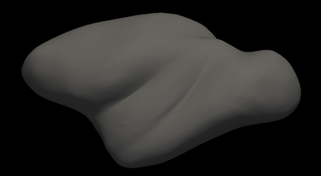 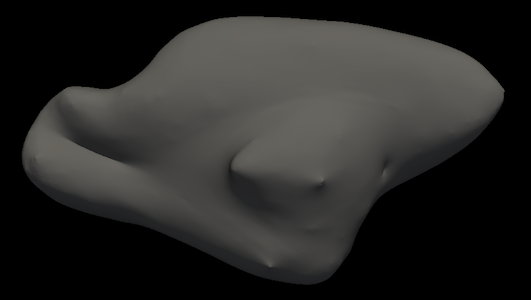\n"
   ]
  },
  {
   "cell_type": "code",
   "execution_count": null,
   "metadata": {},
   "outputs": [],
   "source": [
    "# look at the result and apply fixes in WM definition\n",
    "# you will want to get rid of weird 'stalks' and 'bridges'\n",
    "freeview -v ${fsSurf_mgz}/brain.mgz -v ${fsSurf_mgz}/wm.mgz \\\n",
    "    -f ${fsSurf_temp}/lh.smoothwm ${fsSurf_temp}/lh.inflated \\\n",
    "    ${fsSurf_temp}/rh.smoothwm ${fsSurf_temp}/rh.inflated &"
   ]
  },
  {
   "cell_type": "code",
   "execution_count": null,
   "metadata": {},
   "outputs": [],
   "source": [
    "# redo the tesselation with the freshly fixed WM volume\n",
    "mri_fill -CV ${CC[0]} ${CC[1]} ${CC[2]} \\\n",
    "    -PV ${PONS[0]} ${PONS[1]} ${PONS[2]} \\\n",
    "    ${fsSurf_mgz}/wm.mgz ${fsSurf_mgz}/filled.mgz\n",
    "    \n",
    "mri_pretess ${fsSurf_mgz}/filled.mgz 255 ${fsSurf_mgz}/brain.mgz ${fsSurf_mgz}/wm_filled-pretess255.mgz\n",
    "mri_tessellate ${fsSurf_mgz}/wm_filled-pretess255.mgz 255 ${fsSurf_temp}/lh.orig\n",
    "mri_pretess ${fsSurf_mgz}/filled.mgz 127 ${fsSurf_mgz}/brain.mgz ${fsSurf_mgz}/wm_filled-pretess127.mgz\n",
    "mri_tessellate ${fsSurf_mgz}/wm_filled-pretess127.mgz 127 ${fsSurf_temp}/rh.orig\n",
    "\n",
    "for xh in ${HEMI[@]}; do\n",
    "    mris_extract_main_component ${fsSurf_temp}/${xh}.orig ${fsSurf_temp}/${xh}.orig\n",
    "    mris_smooth -nw ${fsSurf_temp}/${xh}.orig ${fsSurf_temp}/${xh}.smoothwm\n",
    "    mris_inflate ${fsSurf_temp}/${xh}.smoothwm ${fsSurf_temp}/${xh}.inflated\n",
    "    mris_sphere -q ${fsSurf_temp}/${xh}.inflated ${fsSurf_temp}/${xh}.qsphere\n",
    "    \n",
    "    mris_euler_number ${fsSurf_temp}/${xh}.orig\n",
    "    mris_remove_intersection ${fsSurf_temp}/${xh}.orig ${fsSurf_temp}/${xh}.orig\n",
    "    mris_smooth -nw ${fsSurf_temp}/${xh}.orig ${fsSurf_temp}/${xh}.smoothwm\n",
    "    mris_inflate ${fsSurf_temp}/${xh}.smoothwm ${fsSurf_temp}/${xh}.inflated\n",
    "    mris_curvature -thresh .999 -n -a 5 -w -distances 10 10 ${fsSurf_temp}/${xh}.inflated\n",
    "done"
   ]
  },
  {
   "cell_type": "code",
   "execution_count": null,
   "metadata": {},
   "outputs": [],
   "source": [
    "# create the spheres (this takes longer so do it only when you're happy with the inflated)\n",
    "for xh in ${HEMI[@]}; do\n",
    "    mris_sphere ${fsSurf_temp}/${xh}.inflated ${fsSurf_temp}/${xh}.sphere &\n",
    "done"
   ]
  },
  {
   "cell_type": "markdown",
   "metadata": {},
   "source": [
    "#### Create a subject directory in your freesurfer subject directory"
   ]
  },
  {
   "cell_type": "code",
   "execution_count": null,
   "metadata": {},
   "outputs": [],
   "source": [
    "# create a freesurfer SUBJECT with the correct folder structure\n",
    "# NB! $SUBJECTS_DIR should be defined in your ~/.bashrc as the Freesurfer subjects directory\n",
    "echo 'Creating a subject directory for '${SUBJ} 'in:'\n",
    "echo ${SUBJECTS_DIR}/${SUBJ}\n",
    "mksubjdirs ${SUBJECTS_DIR}/${SUBJ}"
   ]
  },
  {
   "cell_type": "markdown",
   "metadata": {},
   "source": [
    "#### Move files to the Freesurfer subjects directory"
   ]
  },
  {
   "cell_type": "code",
   "execution_count": null,
   "metadata": {},
   "outputs": [],
   "source": [
    "# copy the necessary files for cutting to the subject directory\n",
    "for xh in ${HEMI[@]}; do\n",
    "    cp ${fsSurf_temp}/${xh}.inflated ${SUBJECTS_DIR}/${SUBJ}/surf/\n",
    "    cp ${fsSurf_temp}/${xh}.smoothwm ${SUBJECTS_DIR}/${SUBJ}/surf/\n",
    "    cp ${fsSurf_temp}/${xh}.orig ${SUBJECTS_DIR}/${SUBJ}/surf/\n",
    "    cp ${fsSurf_temp}/${xh}.qsphere ${SUBJECTS_DIR}/${SUBJ}/surf/\n",
    "done\n",
    "\n",
    "cp ${fsSurf_mgz}/T1.mgz ${SUBJECTS_DIR}/${SUBJ}/mri/T1.mgz\n",
    "cp ${fsSurf_mgz}/filled.mgz ${SUBJECTS_DIR}/${SUBJ}/mri/filled.mgz\n",
    "cp ${fsSurf_mgz}/wm.mgz ${SUBJECTS_DIR}/${SUBJ}/mri/wm.mgz\n",
    "cp ${fsSurf_mgz}/brain.finalsurfs.mgz ${SUBJECTS_DIR}/${SUBJ}/mri/brain.finalsurfs.mgz\n",
    "cp ${fsSurf_mgz}/brainmask.mgz ${SUBJECTS_DIR}/${SUBJ}/mri/brainmask.mgz"
   ]
  },
  {
   "cell_type": "markdown",
   "metadata": {},
   "source": [
    "Before we can start making the final surfaces we need a little trick to compensate for the low grey/white matter contrast in monkeys. Now that we have a white matter volume we are happy with (if not go back and fix it) we can use it to enhance the GM/WM contrast artificially and bring the voxel values into the range that Freesurfer expects. The difference looks somewhat like this (Left: normal brain, Right: contrast enhanced brain).\n",
    "\n",
    "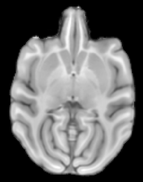 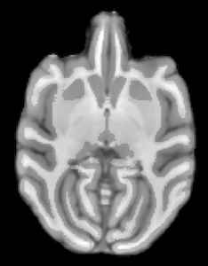"
   ]
  },
  {
   "cell_type": "markdown",
   "metadata": {},
   "source": [
    "#### Make a contrast-enhanced brain volume to aid in getting the pial surface"
   ]
  },
  {
   "cell_type": "code",
   "execution_count": null,
   "metadata": {},
   "outputs": [],
   "source": [
    "# Make a folder for this procedure and convert the necessary files to nifti so we can use `fslmaths`\n",
    "mkdir -p $fsSurf/enh\n",
    "mri_convert ${fsSurf_mgz}/brain.mgz $fsSurf/enh/brain.nii.gz \n",
    "mri_convert ${fsSurf_mgz}/wm.mgz $fsSurf/enh/wm.nii.gz \n",
    "\n",
    "# binarize the wm volume\n",
    "fslmaths $fsSurf/enh/wm.nii.gz -bin $fsSurf/enh/wm_bin.nii.gz\n",
    "\n",
    "# divide the voxel value in the original brain volume by **some** value and add **another** value to the white matter only \n",
    "# which values you need here is up to you but we want to end with white matter voxels having a value ~110 and grey matter ~60-80\n",
    "# alternative ways are definitely possible as long as your end result is similar\n",
    "fslmaths $fsSurf/enh/brain.nii.gz -div 2 $fsSurf/enh/brain2.nii.gz\n",
    "fslmaths $fsSurf/enh/wm_bin.nii.gz -mul 20 $fsSurf/enh/wm_add.nii.gz\n",
    "fslmaths $fsSurf/enh/brain2.nii.gz -add $fsSurf/enh/wm_add.nii.gz $fsSurf/enh/brain_enh.nii.gz\n",
    "\n",
    "# convert the 'enhanced' brain back to mgz\n",
    "mri_convert $fsSurf/enh/brain_enh.nii.gz ${SUBJECTS_DIR}/${SUBJ}/mri/brain_enh.mgz"
   ]
  },
  {
   "cell_type": "markdown",
   "metadata": {},
   "source": [
    "#### Create the surfaces"
   ]
  },
  {
   "cell_type": "code",
   "execution_count": null,
   "metadata": {},
   "outputs": [],
   "source": [
    "# create surfaces\n",
    "# this will take a while. don't wait for it. go get a coffee, call your mother, or read a paper.\n",
    "for xh in ${HEMI[@]}; do\n",
    "    mris_make_surfaces -noaseg -noaparc -T1 brain_enh -orig_wm orig ${SUBJ} ${xh}\n",
    "    mris_sphere ${SUBJECTS_DIR}/${SUBJ}/surf/${xh}.inflated ${SUBJECTS_DIR}/${SUBJ}/surf/${xh}.sphere\n",
    "done"
   ]
  },
  {
   "cell_type": "markdown",
   "metadata": {},
   "source": [
    "You should now have nicely looking inflated white matter surfaces and a projection of it onto a sphere surface. They should look somewhat like the following images.\n",
    "`freeview -f ${fsSurf_temp}/lh.smoothwm ${fsSurf_temp}/lh.inflated ${fsSurf_temp}/lh.sphere &`\n",
    "\n",
    "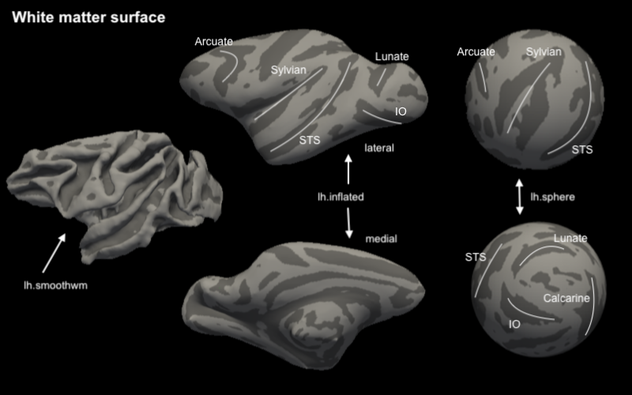"
   ]
  },
  {
   "cell_type": "code",
   "execution_count": null,
   "metadata": {},
   "outputs": [],
   "source": [
    "# freeview -f ${fsSurf_temp}/lh.smoothwm ${fsSurf_temp}/lh.inflated ${fsSurf_temp}/lh.sphere &\n",
    "freeview -f ${SUBJECTS_DIR}/${SUBJ}/surf/lh.smoothwm ${SUBJECTS_DIR}/${SUBJ}/surf/lh.inflated ${SUBJECTS_DIR}/${SUBJ}/surf/lh.sphere &"
   ]
  },
  {
   "cell_type": "code",
   "execution_count": null,
   "metadata": {},
   "outputs": [],
   "source": [
    "# check and edit the pial surface\n",
    "mkdir -p ${SUBJECTS_DIR}/${SUBJ}/pial_edits # create a folder for pial edits\n",
    "cp -R ${SUBJECTS_DIR}/${SUBJ}/mri ${SUBJECTS_DIR}/${SUBJ}/pial_edits/ \n",
    "cp -R ${SUBJECTS_DIR}/${SUBJ}/surf ${SUBJECTS_DIR}/${SUBJ}/pial_edits/"
   ]
  },
  {
   "cell_type": "code",
   "execution_count": null,
   "metadata": {},
   "outputs": [],
   "source": [
    "freeview -v ${SUBJECTS_DIR}/${SUBJ}/pial_edits/mri/T1.mgz ${SUBJECTS_DIR}/${SUBJ}/pial_edits/mri/brain_enh.mgz \\\n",
    "    -f ${SUBJECTS_DIR}/${SUBJ}/pial_edits/surf/lh.white:edgecolor=yellow ${SUBJECTS_DIR}/${SUBJ}/pial_edits/surf/lh.pial:edgecolor=red \\\n",
    "    ${SUBJECTS_DIR}/${SUBJ}/pial_edits/surf/rh.white:edgecolor=yellow ${SUBJECTS_DIR}/${SUBJ}/pial_edits/surf/rh.pial:edgecolor=red &"
   ]
  },
  {
   "cell_type": "code",
   "execution_count": null,
   "metadata": {},
   "outputs": [],
   "source": [
    "# NB! If you adjustments to the brainmask (which probably isn't necessary if NMT segmentation worked well) \n",
    "# don't forget to copy back the adjusted brain_enh for re-generation of the pial surface \n",
    "cp ${SUBJECTS_DIR}/${SUBJ}/pial_edits/mri/brain_enh.mgz ${SUBJECTS_DIR}/${SUBJ}/mri/brain_enh.mgz"
   ]
  },
  {
   "cell_type": "code",
   "execution_count": null,
   "metadata": {},
   "outputs": [],
   "source": [
    "# regenerate the pial surface\n",
    "for xh in ${HEMI[@]}; do\n",
    "    mris_make_surfaces  -noaseg -noaparc -orig_white white -orig_pial white -nowhite -mgz -T1 brain_enh ${SUBJ} ${xh}\n",
    "done"
   ]
  },
  {
   "cell_type": "code",
   "execution_count": null,
   "metadata": {},
   "outputs": [],
   "source": [
    "# create midcortical surface by growing the white matter halfway towards the pial surface\n",
    "for xh in ${HEMI[@]}; do\n",
    "    mris_expand -thickness ${SUBJECTS_DIR}/${SUBJ}/surf/${xh}.white 0.5 ${SUBJECTS_DIR}/${SUBJ}/surf/${xh}.graymid\n",
    "done"
   ]
  },
  {
   "cell_type": "code",
   "execution_count": null,
   "metadata": {},
   "outputs": [],
   "source": [
    "# Fix topology, smooth & inflate the final surfaces\n",
    "for xh in ${HEMI[@]}; do    \n",
    "    mris_euler_number ${SUBJECTS_DIR}/${SUBJ}/surf/${xh}.white\n",
    "    mris_remove_intersection ${SUBJECTS_DIR}/${SUBJ}/surf/${xh}.white ${SUBJECTS_DIR}/${SUBJ}/surf/${xh}.white\n",
    "    mris_smooth -n 3 -nw ${SUBJECTS_DIR}/${SUBJ}/surf/${xh}.white ${SUBJECTS_DIR}/${SUBJ}/surf/${xh}.smoothwm\n",
    "    \n",
    "    mris_euler_number ${SUBJECTS_DIR}/${SUBJ}/surf/${xh}.pial\n",
    "    mris_remove_intersection ${SUBJECTS_DIR}/${SUBJ}/surf/${xh}.pial ${SUBJECTS_DIR}/${SUBJ}/surf/${xh}.pial\n",
    "    mris_smooth -n 3 -nw ${SUBJECTS_DIR}/${SUBJ}/surf/${xh}.pial ${SUBJECTS_DIR}/${SUBJ}/surf/${xh}.smoothpial\n",
    "    \n",
    "    mris_euler_number ${SUBJECTS_DIR}/${SUBJ}/surf/${xh}.graymid\n",
    "    mris_remove_intersection ${SUBJECTS_DIR}/${SUBJ}/surf/${xh}.graymid ${SUBJECTS_DIR}/${SUBJ}/surf/${xh}.graymid\n",
    "    mris_smooth -n 3 -nw ${SUBJECTS_DIR}/${SUBJ}/surf/${xh}.graymid ${SUBJECTS_DIR}/${SUBJ}/surf/${xh}.smoothgraymid\n",
    "    \n",
    "    mris_inflate ${SUBJECTS_DIR}/${SUBJ}/surf/${xh}.smoothwm ${SUBJECTS_DIR}/${SUBJ}/surf/${xh}.inflated\n",
    "    mris_curvature -thresh .999 -n -a 5 -w -distances 10 10 ${SUBJECTS_DIR}/${SUBJ}/surf/${xh}.inflated\n",
    "    mris_sphere ${SUBJECTS_DIR}/${SUBJ}/surf/${xh}.inflated ${SUBJECTS_DIR}/${SUBJ}/surf/${xh}.sphere\n",
    "done"
   ]
  },
  {
   "cell_type": "markdown",
   "metadata": {},
   "source": [
    "#### Cut surfaces and create flatmaps\n",
    "\n",
    "The cells below will load the inflated hemispheres in tksurfer where you can make the cuts to create the flatmaps.  \n",
    "\n",
    "For the full hemisphere make cuts on the medial wall. One cut enclosing the midline and five additional relaxation cuts.\n",
    "Mark a point on the part of the surface you want to keep and save patch as `?h.full.patch.3d` (replace '?' with 'l' and 'r' respectively)\n",
    "\n",
    "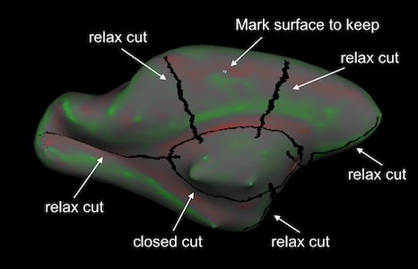\n",
    "\n",
    "For an occipital patch make one cut on the medial wall along the calcarine sulcus. Use 3 points to select a coronal cutting plane, and a fourth point to select which part of the surface you want to keep and save as `?h.occip.patch.3d`\n",
    "\n",
    "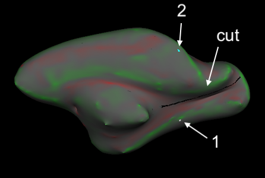 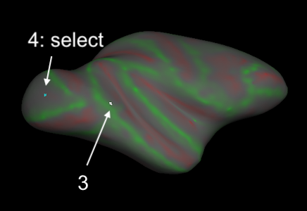"
   ]
  },
  {
   "cell_type": "code",
   "execution_count": null,
   "metadata": {},
   "outputs": [],
   "source": [
    "# left\n",
    "#tksurfer ${SUBJ} lh inflated -curv\n",
    "tksurfer ${SUBJ} lh inflated -gray "
   ]
  },
  {
   "cell_type": "code",
   "execution_count": null,
   "metadata": {},
   "outputs": [],
   "source": [
    "# right\n",
    "#tksurfer ${SUBJ} rh inflated -curv\n",
    "tksurfer ${SUBJ} rh inflated -gray "
   ]
  },
  {
   "cell_type": "code",
   "execution_count": null,
   "metadata": {},
   "outputs": [],
   "source": [
    "# Time for another coffee, you are not going to want to wait for this to finish while staring at its progress\n",
    "cd ${SUBJECTS_DIR}/${SUBJ}/surf/\n",
    "for xh in ${HEMI[@]}; do\n",
    "    mris_flatten -w 0 -distances 20 7 ${xh}.full.patch.3d  ${xh}.full.patch.flat\n",
    "    mris_flatten -w 0 -distances 20 7 ${xh}.occip.patch.3d  ${xh}.occip.patch.flat\n",
    "done"
   ]
  },
  {
   "cell_type": "markdown",
   "metadata": {},
   "source": [
    "If everything went well, you now have flatmaps of the white matter surface. \n",
    "They should look somewhat like this:  \n",
    "\n",
    "**Full hemisphere (rh)**  \n",
    "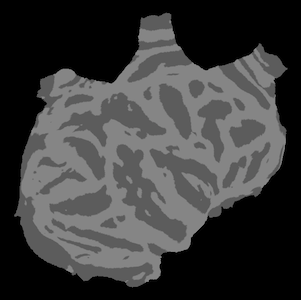 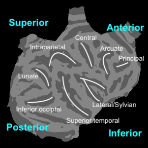\n",
    "\n",
    "**Occipital (rh)** (functional areas are guesstimates based on anatomy)  \n",
    " 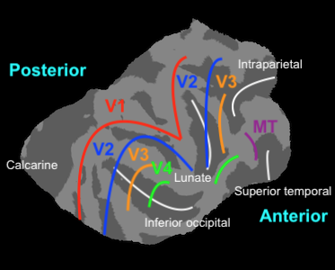\n",
    "\n",
    "It is of course also possible to make **any** other funtionally relevant cutting pattern to extract a flatmap of a piece of cortex. The method is the same."
   ]
  },
  {
   "cell_type": "code",
   "execution_count": null,
   "metadata": {},
   "outputs": [],
   "source": [
    "# check your result\n",
    "#tksurfer ${SUBJ} rh inflated -patch rh.full.patch.flat -curv # for a red/green curvature map\n",
    "tksurfer ${SUBJ} rh inflated -patch rh.full.patch.flat -gray # for a gray curvature map"
   ]
  },
  {
   "cell_type": "markdown",
   "metadata": {},
   "source": [
    "#### Convert Freesurfer surfaces to Gifti\n",
    "Other software may like this better."
   ]
  },
  {
   "cell_type": "code",
   "execution_count": null,
   "metadata": {},
   "outputs": [],
   "source": [
    "mkdir -p gii\n",
    "for xh in ${HEMI[@]}; do\n",
    "    mris_convert ${xh}.white ./gii/${xh}.white.gii\n",
    "    mris_convert ${xh}.graymid ./gii/${xh}.graymid.gii\n",
    "    mris_convert ${xh}.pial ./gii/${xh}.pial.gii\n",
    "    mris_convert ${xh}.inflated ./gii/${xh}.inflated.gii\n",
    "\n",
    "    mris_convert ${xh}.smoothwm ./gii/${xh}.smoothwm.gii\n",
    "    mris_convert ${xh}.smoothgraymid ./gii/${xh}.smoothgraymid.gii\n",
    "    mris_convert ${xh}.smoothpial ./gii/${xh}.smoothpial.gii\n",
    "    \n",
    "    mris_convert -p -c ${xh}.curv ${xh}.full.patch.flat ./gii/${xh}.full.patch.flat.gii\n",
    "    mris_convert -p -c ${xh}.curv ${xh}.occip.patch.flat ./gii/${xh}.occip.patch.flat.gii\n",
    "done"
   ]
  },
  {
   "cell_type": "markdown",
   "metadata": {},
   "source": [
    "#### Copy Freesurfer results back to NMT template folder"
   ]
  },
  {
   "cell_type": "code",
   "execution_count": null,
   "metadata": {},
   "outputs": [],
   "source": [
    "cp -r ${SUBJECTS_DIR}/${SUBJ}/surf ${fsSurf}/surf"
   ]
  },
  {
   "cell_type": "code",
   "execution_count": null,
   "metadata": {},
   "outputs": [],
   "source": [
    "# return to startpath\n",
    "cd ${startpath}"
   ]
  },
  {
   "cell_type": "markdown",
   "metadata": {},
   "source": [
    "----\n",
    "----\n",
    "## **Step 4 (OPTIONAL): Create additional surfaces using Connectome Workbench.**\n",
    "This should not be necessary at all. Try the Freesurfer approach and a conversion to gifti with `mris_convert` first (as explained above)  \n",
    "\n",
    "----\n",
    "----\n",
    "\n",
    "### Requirements\n",
    "  - Connectome Workbench (https://www.humanconnectome.org/software/connectome-workbench)  "
   ]
  },
  {
   "cell_type": "code",
   "execution_count": null,
   "metadata": {},
   "outputs": [],
   "source": [
    "# THIS SHOULDN'T BE NECESSARY SINCE WE'RE GETTINGS THESE OUTPUTS ALSO FROM THE FREESURFER PIPELINE !! #\n",
    "\n",
    "# set path to where you want the results\n",
    "wbSurf_path=${NMT_path}/single_subject_scans/${SUBJ}/wbSurf\n",
    "\n",
    "echo 'Extracting surfaces from segmentation'\n",
    "cd ${wbSurf_path}\n",
    "\n",
    "# create surfaces\n",
    "IsoSurface -input ${NMT_ss_path}/NMT_${SUBJ}_process/${SUBJ}_segmentation.nii.gz \\\n",
    "    -isorois -o_gii surf\n",
    "\n",
    "# rename to something recognizable\n",
    "mv surf.k2.gii gm.surf.gii # gm surface\n",
    "mv surf.k3.gii wm.surf.gii # wm surface\n",
    "\n",
    "# Smooth the surfaces a bit\n",
    "echo 'Smoothing the surfaces a bit' \n",
    "wb_command -surface-smoothing wm.surf.gii 0.5 1 wm_sm.surf.gii\n",
    "wb_command -surface-smoothing gm.surf.gii 0.5 1 gm_sm.surf.gii\n",
    "\n",
    "# inflate the surfaces\n",
    "echo 'Inflating the surfaces'\n",
    "wb_command -surface-generate-inflated \\\n",
    "    wm_sm.surf.gii infl_wm_sm.surf.gii vinfl_wm_sm.surf.gii\n",
    "wb_command -surface-generate-inflated \\\n",
    "    gm_sm.surf.gii infl_gm_sm.surf.gii vinfl_gm_sm.surf.gii\n",
    "\n",
    "# view the result in your favorite viewer\n",
    "echo 'Inspect the surfaces in a viewer'\n",
    "freeview -f wm_sm.surf.gii infl_wm_sm.surf.gii vinfl_wm_sm.surf.gii \\\n",
    "    gm_sm.surf.gii infl_gm_sm.surf.gii vinfl_gm_sm.surf.gii"
   ]
  },
  {
   "cell_type": "code",
   "execution_count": null,
   "metadata": {},
   "outputs": [],
   "source": []
  }
 ],
 "metadata": {
  "kernelspec": {
   "display_name": "Python 3",
   "language": "python",
   "name": "python3"
  },
  "language_info": {
   "codemirror_mode": "shell",
   "file_extension": ".sh",
   "mimetype": "text/x-sh",
   "name": "bash"
  }
 },
 "nbformat": 4,
 "nbformat_minor": 2
}
