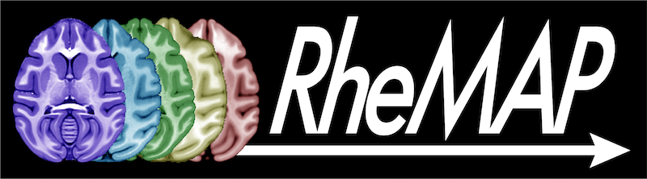
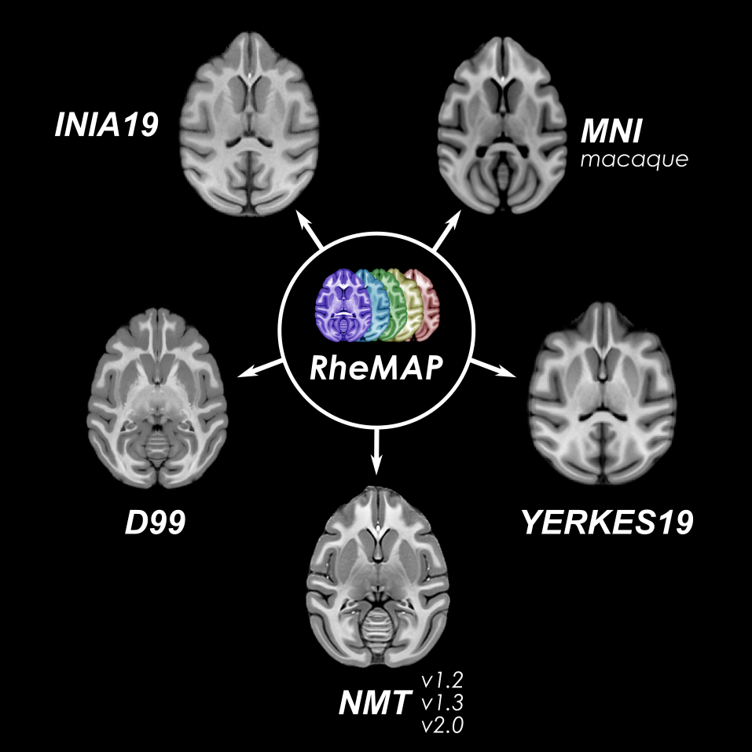

## RheMAP    

    

|                     |                                                                                         |
| :------------------ | :-------------------------------------------------------------------------------------- |
| **Name**            | RheMAP                                                                                  |    
| **Authors**         | [Nikoloz Sirmpilatze](https://github.com/niksirbi) (German Primate Center) [Chris Klink](https://github.com/pcklink) (Netherlands Institute for Neuroscience)      |
| **Description**     | Non-linear warps across a set of the most common rhesus macaque brain templates.        |
| **Documentation**   | [RheMAP on GitHub](https://github.com/PRIME-RE/RheMAP)                                  |
| **Link**            | [Dataset of warps and warped templates at Zenodo](https://doi.org/10.5281/zenodo.3668510) |
| **Language**        | [RheMAP on GitHub](https://github.com/PRIME-RE/RheMAP) includes Jupyter notebooks in Python |
| **Publication**     | Sirmpilatze, Nikoloz and Klink, P. Christiaan (2020). RheMAP: Non-linear warps between common rhesus macaque brain templates (Version 1)[Data set]. Zenodo. https://doi.org/10.5281/zenodo.3668510|
| **Communication**   | <p.c.klink@gmail.com>                                                                   |
| **Restrictions**    | Please cite the Zenodo dataset when you use this in your work                           |
    

