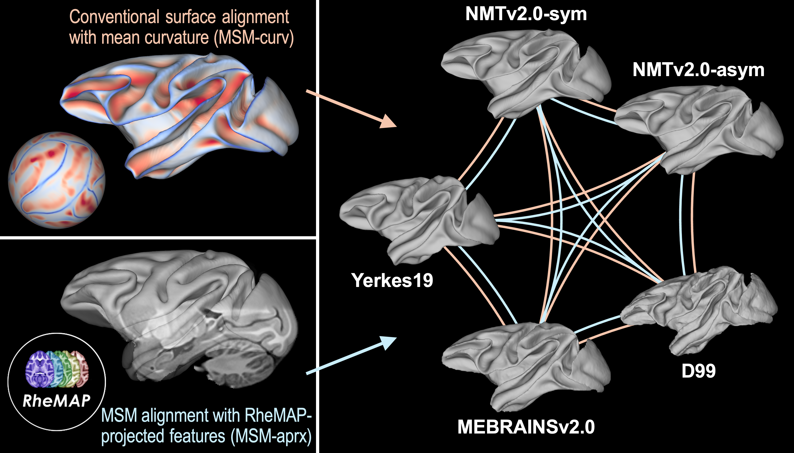

## RheMAP    

        
    

|                     |                                                                                         |
| :------------------ | :-------------------------------------------------------------------------------------- |
| **Name**            | RheMAP                                                                                  |    
| **Authors**         | [Nikoloz Sirmpilatze](https://github.com/niksirbi) (German Primate Center) [Chris Klink](https://github.com/pcklink) (Netherlands Institute for Neuroscience)      |
| **Description**     | Non-linear warps across a set of the most common rhesus macaque brain templates.        |
| **Documentation**   | [RheMAP on GitHub](https://github.com/PRIME-RE/RheMAP)                                  |
| **Link**            | [Dataset of warps and warped templates at Zenodo](https://doi.org/10.5281/zenodo.3668510) |
| **Language**        | [RheMAP on GitHub](https://github.com/PRIME-RE/RheMAP) includes Jupyter notebooks in Python |
| **Publication**     | Sirmpilatze, Nikoloz and Klink, P. Christiaan (2020). RheMAP: Non-linear warps between common rhesus macaque brain templates (Version 1)[Data set]. Zenodo. https://doi.org/10.5281/zenodo.3668510|
| **Communication**   | <p.c.klink@gmail.com>                                                                   |
| **Restrictions**    | Please cite the Zenodo dataset when you use this in your work                           |
    

## RheMAP-Surf    

        
    

|                     |                                                                                         |
| :------------------ | :-------------------------------------------------------------------------------------- |
| **Name**            | RheMAP-Surf                                                                             |    
| **Authors**         | Zi-Xuan Zhou](https://orcid.org/0000-0002-9894-7934) & [Ting Xu](https://github.com/TingsterX) (Child Mind Institute)       |
| **Description**     | **Surface transformations** among commonly used rhesus macaque brain templates. Two alternative sets of deformation spheres are provided.         |
| **Documentation**   | [RheMAP-Surf markdown reports on GitHub](https://github.com/HumanBrainED/RheMAP-Surf)     |
| **Link**            | Zenodo archive [(dataset, code, and intermediate results)](https://doi.org/10.5281/zenodo.15642802) and GitHub repository [RheMAP-Surf](https://github.com/HumanBrainED/RheMAP-Surf)  |
| **Language**        | shell, workbench, python |
| **Publication**     | Zhou, Z.-X., & Xu, T. (2025). RheMAP-Surf: Surface Transformations Among Commonly Used Rhesus Macaque Brain Templates (1.0) [Data set]. Zenodo. https://doi.org/10.5281/zenodo.15642802|
| **Communication**   | <zixuan.zhou@childmind.org>, <Ting.Xu@childmind.org>                                    |
| **Restrictions**    | Please cite the Zenodo archive when you use this in your work.                          |
    

[//]: # (This script is necessary to render the rating widgets)
[//]: # (Use this code to insert a widget)
[//]: # (

)

